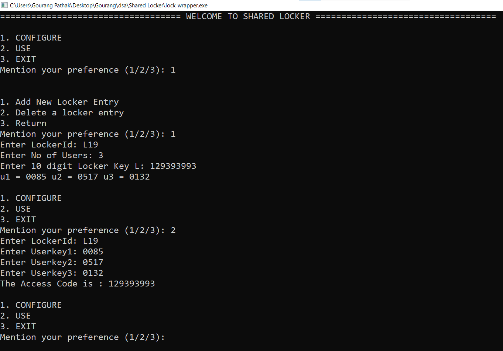

# Shared-Locker

### This is a shared Locker system where a user can store their secret (primary) keys, and later use given (secondary) keys to access his/her secret key.

## Functionalities
1. CONFIGURE YOUR KEY
2. GET YOUR KEY

### CONFIGURING
1. Add a New Locker Key
2. Delete A Locker Key

### Demo of the Locker

https://user-images.githubusercontent.com/89131980/190414716-6a80d40b-9a0d-4370-ab74-107d089e001d.mp4

### Sample Output

